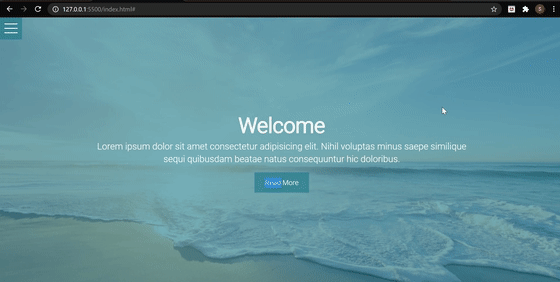

# Hamburger-menu-overlay

*"A simple project to create a Hamburger overlay menu alongwith some animations using pure HTML and CSS only"*

## Tech Stack

- HTML
- CSS
    - FlexBox
    - Advanced selectors
    - CSS transitions and transforms
    

## Installation

Clone the git repository:

```sourceCode console
$ git clone https://github.com/SASHA-PAIS/Hamburger-menu.git

$ cd Hamburger-menu
```

## Design




The Hamburger menu is actually a checkbox. When the checkbox is checked, the overlay menu is visible.
 
CSS custom variables for colours and menu opening speed are defined in the root scope of style.css. This can be accessed in menu.css as well.

CSS transitions and the Transform property are used to produce a fancy toggler animation effect.

##  Acknowledgement

- Stock images from https://unsplash.com/
- https://fonts.google.com/for some amazing font options
- Tips used from Brad Traversy - Udemy


